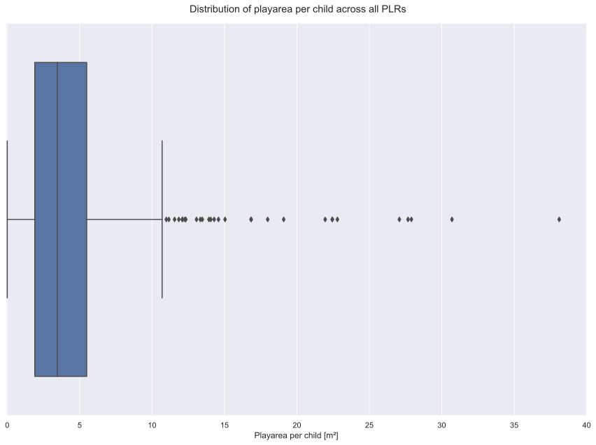
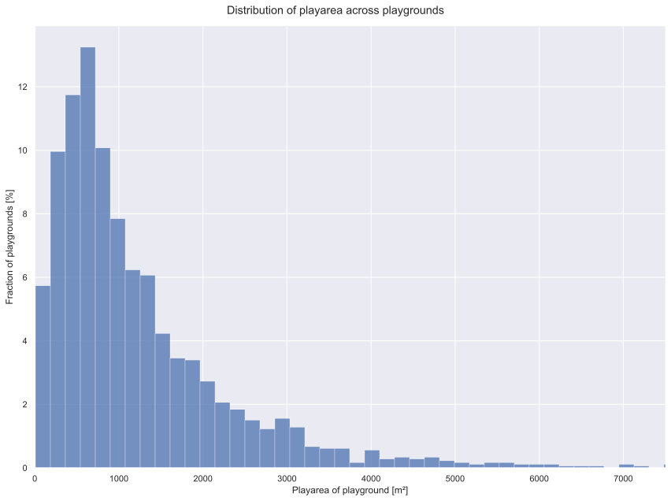

1. Please choose a topic from the fields of traffic, urban planning, climate change, land use or housing in Europe.
2. Research data on that topic and provide a) a clear working title, b) a hypothesis what you can answer about that topic by the help of the data, c) a reason why this is relevant for a larger journalistic audience.
3. Then give some main findings you saw in that data in the form of bullet points. You can also include graphs or any other form of visualization to prove a point you would want to make. Your preliminary results can either be heavily focused on data analysis, data visualization, illustration or text-based reasoning on the basis of the data you found.
4. What would you do next about the article? Which are open questions you'd continue working on? Is there further research you'd want to do based on your initial research? Or do you have nice visual ideas that you'd like to develop based on your initial findings?

# Equality of access to public playgrounds for children in the city of Berlin
## Data
"Lebensweltlich orientierte Räume" (LORs) of Berlin - A system by the municipality to split Berlin into smaller areas. The finest granularity are 542 "Planungsräume" (PLRs). [daten.berlin.de](https://daten.berlin.de/datensaetze/lebensweltlich-orientierte-r%C3%A4ume-lor-planungsr%C3%A4ume-01012021-wfs)
Inhabitants of Berlin 06/2021 - Number of inhabitants per PLR, split up by age [statistik-berlin-brandenburg.de](https://www.statistik-berlin-brandenburg.de/a-i-16-hj)
Children in poverty 12/2020 - Percentage of children living in poverty per PLR, taken out of the report on social city development [daten.berlin.de](https://daten.berlin.de/datensaetze/monitoring-soziale-stadtentwicklung-2021-kontext-indikatoren-ohne-k08-k14-k15-wfs)
Playgrounds in Berlin as of March 2023 - A list of publicly owned playgrounds accessible to every citizen [daten.berlin.de](https://daten.berlin.de/datensaetze/gr%C3%BCnanlagenbestand-berlin-einschl-der-%C3%B6ffentlichen-spielpl%C3%A4tze-spielpl%C3%A4tze-wfs)

A repository with source files and scripts is linked [here](https://github.com/docweirdo/public_playgrounds_berlin/archive/main.zip).
## Hypothesis
With this data, I can analyze whether playground access is distributed fairly among the population of children living in the city.

I can check how many playgrounds and how much playarea is available to each child. I can further break down the analysis to each PLR and calculate the availability of playgrounds relative to the amount of children living in said PLR. Finally, I can compare these values with regard to different levels of child poverty in each PLR.

## Importance
Cooperation, exploration, play and physical exercise are important factors for a healthy development of children. Part of a municipality's obligation is to ensure and foster the healthy development of its population, especially its minors. Public playgounds are an important part of these efforts. Accessible free of charge they allow for social participation by children regardless of their economic background. But public playgrounds are heterogeneous in size and location as is the distribution of the population of children the playgrounds are meant for. Families of children living in poverty might not have the political leverage to ensure equal access and availability of playgrounds to their children. Analyzing and reporting on the fairness of distribution and accessability of these public efforts is the responsibility of the press. Informing the public on the outcome of public investments serves as a control mechanism of government.

## Main findings
- Berlin features 1797 proper public playgrounds for its 611899 children.
- Differences are considerable: playground area per child between PLRs range from 0m² to 38.1m².
- These differences do not follow a clear geographical pattern.
- Half of the PLRs feature a playarea to child ratio between 1.90m² and 5.49m².
- Median play area of playgrounds is 875m².
- Child poverty is not a factor in the distribution: the pearson correlation coefficient between child poverty and playground area across PLRs is -0.074.

## Visualizations

This Chloropleth allows for a comparison of the available playarea for each child in the respective PLRs. There is no clear geographic pattern.
 

This Figure shows that there is no clear correlation between the playarea available to each child per PLR and the child poverty percentage of that PLR.
 

Visualisation of the differences in playground area per child across all PLRs. The blue box represents the PLRs with values in between the first and third quartile (interquartile range). Within that box, 50 percent of values are located.
 

This map shows how much of the total area of each PLR is dedicated as playarea.

Finally, this diagramm shows the distribution of sizes for playgrounds.

## Outlook
To pour this analysis into an article, I would drastically reduce the complexity of visualisations and numbers provided. This is the output of a data analysis and nowhere near an article presentable to the average audience. The lack of data leaves questions open about the quality of playgrounds, the accessibilty of playgrounds via public transportation or other means of transportation. Instead of multiple figures and plots, I would provide an interactive map, so the reader is able to familiarize themselves with the findings. 
 
This could be a start:

<!-- map from [index.html](web/index.html) -->
Note: the colouring bucktes are the same as in the first choropleth.

## Limitations
- Some playgrounds are right next to the border of an PLR, but in this analysis not considered accessible for children in adjunct PLRs. Playgrounds touching or crossing PLR bounds are considered accessible for both PLRs.
- There are many playgrounds which are publicly accessible, but privately held. These are not considered in this analysis, as it is hard to find data on them. I initially used data from open street maps, but found them to be unreliable.
- Two playgrounds did not have data on the effective playarea. I used the total area of the playground instead.
- The data on child poverty is half a year apart from the population data, which might impact the results ever so slightly
- There is no data on the quality of playgrounds.
- This analysis does not regard parks or greenery which are not considered playgrounds by the municipality. But children can play in a park arguably just as well as on a playground.